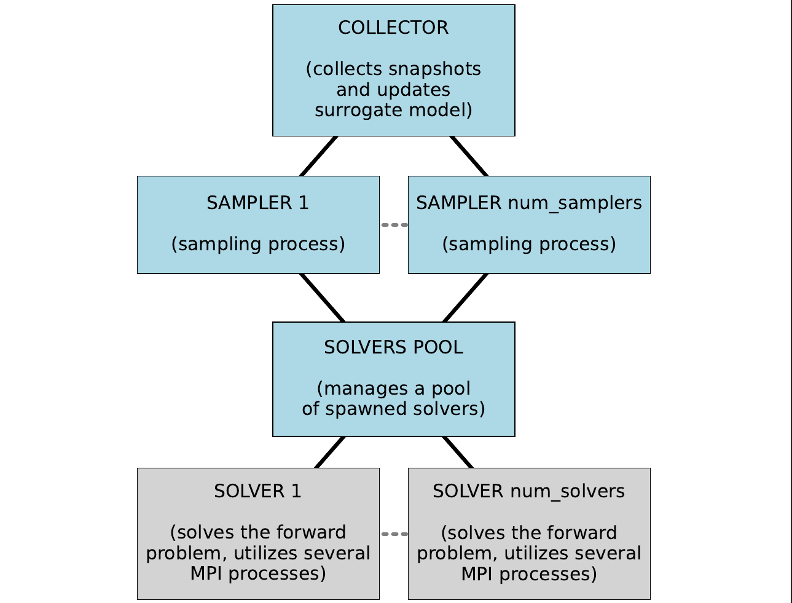

# surrDAMH
Python implementation of surrogate-accelerated Markov chain Monte Carlo methods for postrior sampling in Bayesian inversion. Based on the delayed acceptance Metropolis-Hastings algorithm.

## Requirements
- numpy
- scipy
- mpi4py
- matplotlib
- torch (for neural network surrogate model)
- scikit-learn (for polynomial surrogate model)
- pandas (for post-processing)
- emcee (for post-processing)

## Bayesian inverse problem setting
What is given:
 - forward model: $G:\mathbb{R}^{n}\rightarrow\mathbb{R}^{m}$
 - observations (noisy outputs of the forward model): $y\in\mathbb{R}^{m}$
 - prior probability density function (pdf): $f_{U}$
 - noise pdf: $f_{Z}$

Input parameters $u\in\mathbb{R}^{n}$ are unknown.

Additive noise is considered; therefore, the posterior pdf is given by the following formula:

$f_{U|Y}\left(u|y\right)\propto{f_{Z}\left(y-G\left(u\right)\right)}{f_{U}\left(u\right)}$

## Parallel processes:
 - several Markov chains generated in parallel
 - the chains share one surrogate model, which is refined during the sampling process using data from all chains
 - the chains share a pool of spawned solvers (processes that evaluate $G$)
    - assumed to be the computationally most demanding part
    - a solver is typically a linked numerical library
    - number of solvers is typically lower than number of chains

## Getting started:
 - open repository in the Docker container (e.g. using the Dev Containers extension of Visual Studio Code)
 - `pip install .`

Before running the sampling process, it is necessary to specify:
 - configuration (basic settings, e.g. number of solvers, initial samples, ...)
 - prior
 - likelihood
 - solver specification
 - surrogate model updater
 - list of stages

See examples in the **toy_examples** folder, e.g.:
 - `cd toy_examples/`
 - `mpiexec -n 4 python3 -m mpi4py minimal_example.py`

## Surrogate models:
The following non-intrusive surrogate models are implemented. They are constructed from snapshots $\left(u^{\left(k\right)},G\left(u^{\left(k\right)}\right)\right)$ and they can be adaptively refined during the sampling process.
 - polynomial chaos approximation - complete polynomials, adaptive increase of maximum degree based on available data (using scikit-learn)
 - radial basis functions interpolation (RBF) - combined with polynomials up to chosen degree (using SciPy)
 - approximation using nearest points identified using kd-tree (using SciPy)
 - multilayer perceptron regressor (using PyTorch)

